# Jogo da memória em Flutter com tema personalizado

## O projeto

Este projeto é uma extensão do projeto [Jogo da memória](https://github.com/oberdancunha/flutter-memory-game-app). Diferentemente do projeto original, em que existe um único tema de cores, fontes e imagens no aplicativo, nesse projeto o visual é modificado de acordo com o tipo da carta escolhida.

## Tecnologias/bibliotecas

Algumas das tecnologias/bibliotecas utilizadas na construção do aplicativo foram:

 - Flutter toolkit 3.3.4 (stable)
 - Dart 2.18.2
 - flutter_modular 5.0.3
 - flutter_triple: 1.2.7+4
 - flutter_screenutil 5.5.4
 - carousel_slider: 4.0.0
 - dart_code_metrics 4.10.1
 - freezed_annotation: 1.1.0
 - freezed: 1.1.0
 - lint 1.8.2
 - mocktail 0.1.4
 - triple_test: 0.0.8
 - flutter_launcher_icons https://github.com/Davenchy/flutter_launcher_icons.git
 - flutter_native_splash 2.0.5

Além dessas, há também outras bibliotecas. O pubspec.yaml possui a lista completa das bibliotecas utilizadas.

## Estrutura

A estrutura desse projeto segue o modelo semelhante ao descrito no [Exemplo de Monorepo com Flutter](https://github.com/oberdancunha/flutter-mail-and-drive-apps), sendo 3 aplicações e 1 produto.

### Aplicações

##### flutter_memory_game_custom_theme_dependency_module

É a aplicação responsável por registrar e disponibilzar as bibliotecas usadas por todo o projeto.

##### flutter_memory_game_custom_theme_design_system

É a aplicação responsável pelo visual do aplicativo. É nesta aplicação onde é realizada a troca de cores, fontes e imagens de acordo com o tipo da carta escolhida.

##### flutter_memory_game_custom_theme_core

Basicamente, o algoritmo central do jogo desenvolvido originalmente no projeto [Jogo da memória](https://github.com/oberdancunha/flutter-memory-game-app) está localizado nessa aplicação, incluindo toda a arquitetura, configuração das dependências a serem injetadas para a troca das cartas, bem como a mecânica das jogadas.

Resumidamente, todas as técnicas utilizadas em torno do jogo, descritas no projeto original, pertencem a essa aplicação.

### Produto
O produto é o <b> flutter_memory_game_custom_theme_app </b>. É onde as rotas estão prontas, as injeções de dependências são executadas, as aplicações, com seus respectivos parâmetros, são devidamente encaixadas, e por fim, onde o Flutter realiza a contrução do aplicativo que será disponível para os usuários Android e iOS.

### Temas

Abaixo estão as cartas disponíveis com seus respectivos temas. A primeira figura é a tela de início do jogo.

  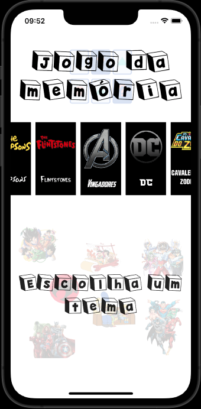
  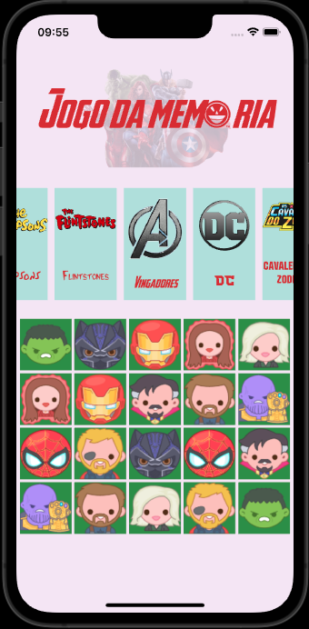
  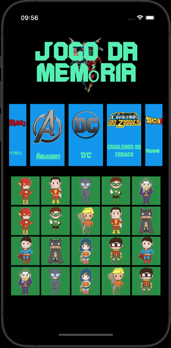
  

  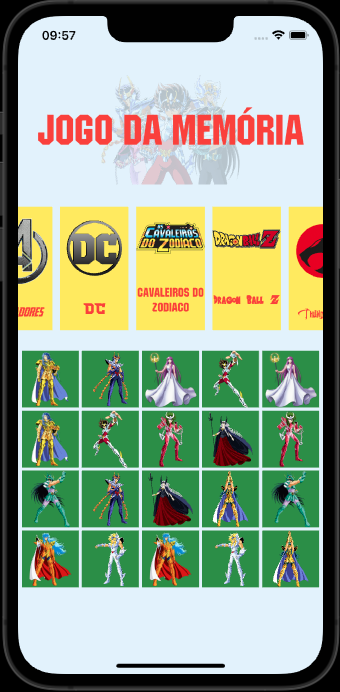
  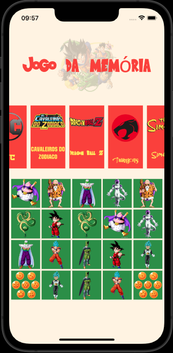
  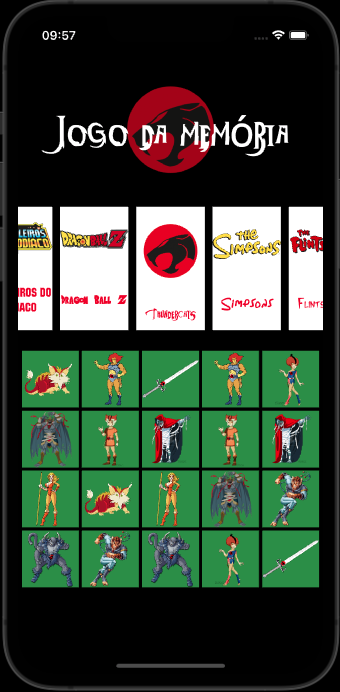
  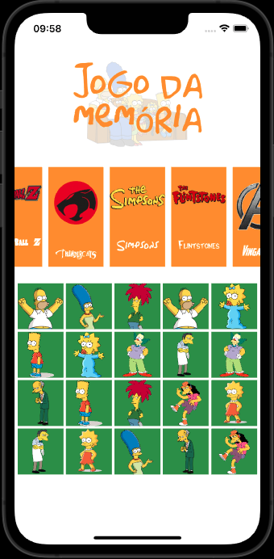
  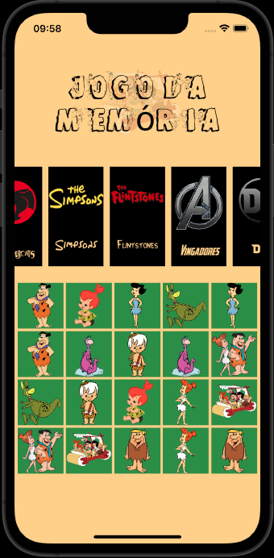

#### Abrir jogo

<table>
  <tr>
    <td width="50%">
      

        
      

      

        iPhone 7
      

    </td>
    <td width="50%">
      

        
      

      

        Samsung Galaxy J5
      
  
    </td>
  </tr>
  <tr>
    <td width="50%">
      

        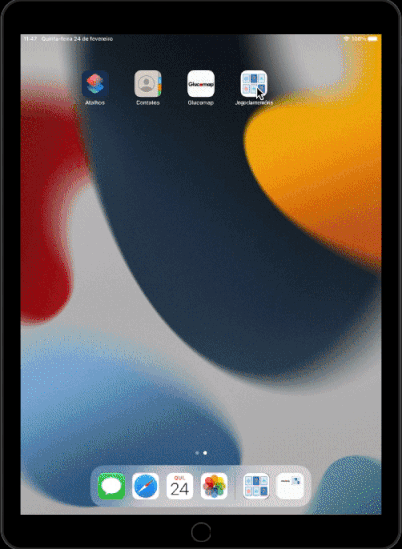
      

      

        Emulador iPad 9th generation
      

    </td>
  </tr>
</table>

### Jogar

#### iPhone 7

<table>
  <tr>
    <td>
      

        
      

      

        Iniciando o jogo
      

    </td>
    <td>
      

        
      

      

        Finalizando o jogo
      

    </td>
  </tr>
</table>

#### Samsung Galaxy J5

<table>
  <tr>
    <td>
      

        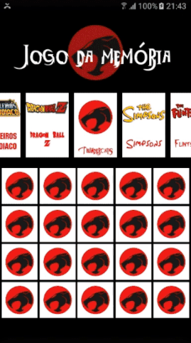
      

      

        Iniciando o jogo
      

    </td>
    <td>
      

        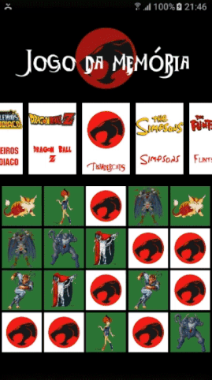
      

      

        Finalizando o jogo
      

    </td>
  </tr>
</table>

#### Emulador iPad 9th generation

<table>
  <tr>
    <td>
      

        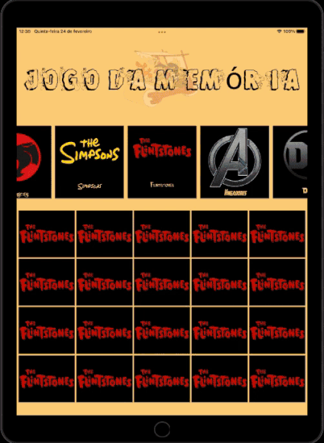
      

      

        Iniciando o jogo
      

    </td>
    <td>
      

        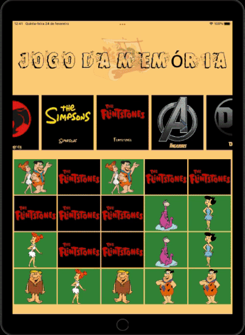
      

      

        Finalizando o jogo
      

    </td>
  </tr>
</table>

## Imagens, ícones e fontes

As imagens, ícones e fontes usadas no projeto foram obtidas nos seguintes endereços:

- 
Icons made by <a href="https://www.freepik.com" title="Freepik">Freepik</a> from <a href="https://www.flaticon.com/" title="Flaticon">www.flaticon.com</a>

- [pinterest](https://br.pinterest.com/)
- [pngegg](https://www.pngegg.com/)
- [fontspace](https://www.fontspace.com)
- [dafont](https://www.dafont.com)
- [fonts4free](https://www.fonts4free.net)
- [legionfonts](http://legionfonts.com)
- [pngall](https://www.pngall.com)
- [freefontsdownload](https://freefontsdownload.net)